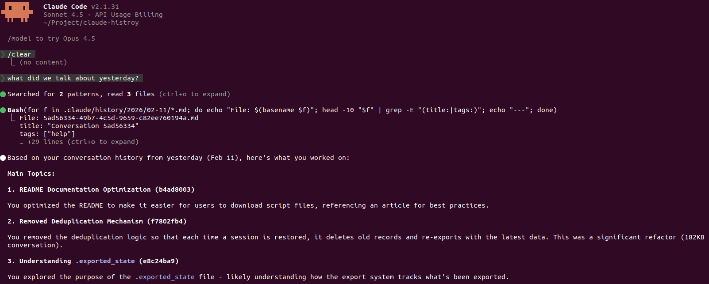

# Claude Code Conversation History

> "Claude, what did we work on yesterday?"

Give Claude Code long-term memory. Automatically export every conversation to Markdown, then search and reference them anytime.


## Installation & Configuration

### 1. Requirements

- **Python 3.x** - Scripts require Python 3 environment
- **Claude Code CLI** - Claude Code command-line tool must be installed

### 2. Download Script Files

```bash
# Create directory
mkdir -p .claude/scripts

# Download script files from GitHub
curl -o .claude/scripts/export-conversation.sh \
  https://raw.githubusercontent.com/Hanzzh/claude-history/main/scripts/export-conversation.sh

curl -o .claude/scripts/export-conversation.py \
  https://raw.githubusercontent.com/Hanzzh/claude-history/main/scripts/export-conversation.py

# Set execute permission
chmod +x .claude/scripts/export-conversation.sh
```

### 3. Expected Directory Structure

```
.claude/
├── scripts/
│   ├── export-conversation.sh    # Shell wrapper script
│   └── export-conversation.py    # Python export script
├── settings.local.json            # Claude Code configuration file
└── history/                      # Export directory (auto-created)
    └── index.md
```

### 4. Configuration File

Edit `.claude/settings.local.json` and add `hooks` and `permissions` configuration:

```json
{
  "permissions": {
    "allow": [
      "Bash(timeout:*)",
      "Bash(.claude/scripts/export-conversation.sh:*)"
    ]
  },
  "hooks": {
    "SessionEnd": [
      {
        "matcher": "logout|prompt_input_exit|other",
        "hooks": [
          {
            "type": "command",
            "command": "timeout 10 \"$CLAUDE_PROJECT_DIR\"/.claude/scripts/export-conversation.sh",
            "async": true
          }
        ]
      }
    ]
  }
}
```

**Configuration Notes**:
- `permissions.allow` - Allow execution of export script
- `SessionEnd` - Trigger when exiting session
- `matcher` - Match all exit methods (Ctrl+D, exit, logout)
- `async: true` - Execute asynchronously without blocking exit process

### 5. Optional: Install Skills

Skills enable Claude Code to proactively search your conversation history.

```bash
# Create skills directory
mkdir -p .claude/skills/search-history

# Download search-history skill
curl -o .claude/skills/search-history/SKILL.md \
  https://raw.githubusercontent.com/Hanzzh/claude-history/main/skills/search-history/SKILL.md
```

**What it does**: When you ask about something discussed before, Claude Code will:
- Detect time range from your query (yesterday, a few days ago, etc.)
- Search `.claude/history/` for relevant conversations
- Summarize previous discussions and relate them to your current question

**Example usage**:
```
You: What did we work on yesterday?
You: How did we handle that state management decision?
```

### 6. Usage

#### Enable Auto-Export

1. Ensure scripts are placed in the correct location
2. Set script execute permissions
3. Configure `settings.local.json`
4. Restart Claude Code

#### Test if It Works

Type in Claude Code:
```
/hooks
```

You should see the configured SessionEnd hook.

#### Normal Usage

1. Use Claude Code for conversations
2. Export triggers automatically on exit (Ctrl+D / exit / logout)
3. Check `.claude/history/index.md` for exported conversation list

---

## How It Works

Uses Claude Code's **SessionEnd hook** to automatically trigger export process when each conversation ends:

```
User exits Claude Code (Ctrl+D / exit / logout)
    ↓
Trigger SessionEnd hook
    ↓
Execute export-conversation.sh
    ↓
Call export-conversation.py
    ↓
Parse JSONL format conversation records
    ↓
Convert to Markdown with YAML frontmatter
    ↓
Save to .claude/history/YYYY/MM-DD/{session-id}.md
    ↓
Update index.md index
```

### Features

- ✅ **Fully Automated**: No manual operation needed, exports on exit
- ✅ **Complete Content**: Preserves user messages, assistant replies, tool calls
- ✅ **YAML frontmatter**: Supports tags, dates, metadata
- ✅ **Auto Index**: Updates index.md to record all conversations
- ✅ **Update on Re-export**: Deletes old files and re-exports on session end

---

## Export Location

### Directory Structure

```
.claude/history/
├── index.md                          # Global conversation index
└── YYYY/                             # Organized by year
    └── MM-DD/                        # Organized by month-day
        ├── {session-id-a}.md
        ├── {session-id-b}.md
        └── ...
```

**Example**: `.claude/history/2026/02-11/abc123-def456.md`

### Markdown File Format

Each exported conversation file contains:

```markdown
---
title: "Conversation Title"
date: 2026-02-11
tags: ["bug-fix", "feature-development"]
session_id: abc123-def456
project: /home/han/Documents/han_vault
---

# Conversation Title

**Session ID**: `abc123-def456`
**Date**: 2026-02-11
**Messages**: 23
**Tags**: bug-fix, feature-development

---

## User

User message content...

## Claude

Assistant reply content...

**Tool Use**: `Edit`

```json
{
  "file_path": "...",
  "old_string": "...",
  "new_string": "..."
}
```

---

**View export logs**:
- Hook runs with `async: true`, output won't display directly
- Use `Ctrl+O` to toggle verbose mode and check execution status

**Manually test export**:
```bash
echo '{"session_id":"test","transcript_path":"/path/to/test.jsonl","cwd":"/home/han/Documents/han_vault"}' | \
  .claude/scripts/export-conversation.sh
```

---

## Technical Details

### Hook Configuration

**Location**: `.claude/settings.local.json`

**Configuration**:
```json
{
  "hooks": {
    "SessionEnd": [{
      "matcher": "logout|prompt_input_exit|other",
      "hooks": [{
        "type": "command",
        "command": "\"$CLAUDE_PROJECT_DIR\"/.claude/scripts/export-conversation.sh",
        "async": true
      }]
    }]
  }
}
```

### Export Scripts

#### export-conversation.sh

Shell wrapper script that calls the Python export program.

#### export-conversation.py

Core functionality:

- **parse_transcript()**: Parse JSONL format conversation records
- **extract_content()**: Extract various message content types
- **generate_title()**: Generate title from first user message (skip tool messages)
- **extract_tags()**: Auto-generate tags based on keywords
- **to_markdown()**: Convert to Markdown with YAML frontmatter
- **save_conversation()**: Save files organized by date
- **update_index()**: Update global index

---

## Key Files

### Configuration Files
- `.claude/settings.local.json` - Hook configuration

### Script Files
- `.claude/scripts/export-conversation.sh` - Shell wrapper script
- `.claude/scripts/export-conversation.py` - Python export program

### Export Files
- `.claude/history/index.md` - Global conversation index
- `.claude/history/YYYY/MM-DD/{session-id}.md` - Specific conversation files

## Troubleshooting

### Hook Not Triggered

- Check if `settings.local.json` syntax is correct
- Use `/hooks` command to view configured hooks
- Confirm matcher matches exit method

### Empty Export Content

- Check if transcript_path exists
- View Python script error logs
- Some sessions may not have complete records

### Permission Issues

- Ensure `.claude/scripts/*.sh` has execute permissions: `chmod +x`
- Python script needs read access to `~/.claude/projects/`

---
